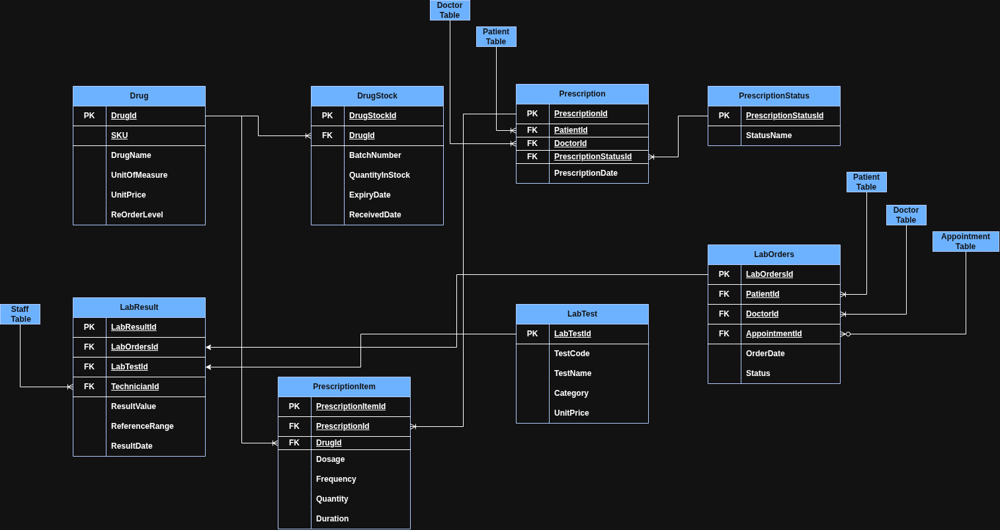

# Hospital Management System Back end 

## Database Architecture 

Below is the domain_driven ERD covering all 38 table across 6 Bounded Contexts

 

Git practice - branch A and B merged
Patient registration feature
nvim README.md
